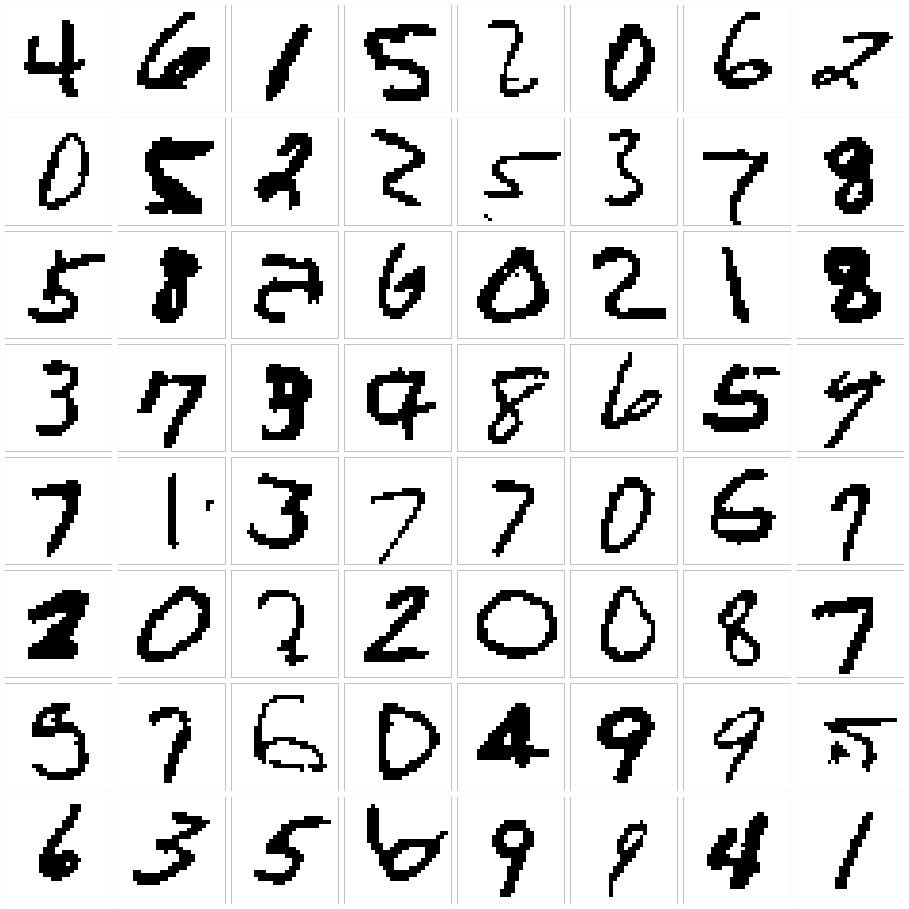
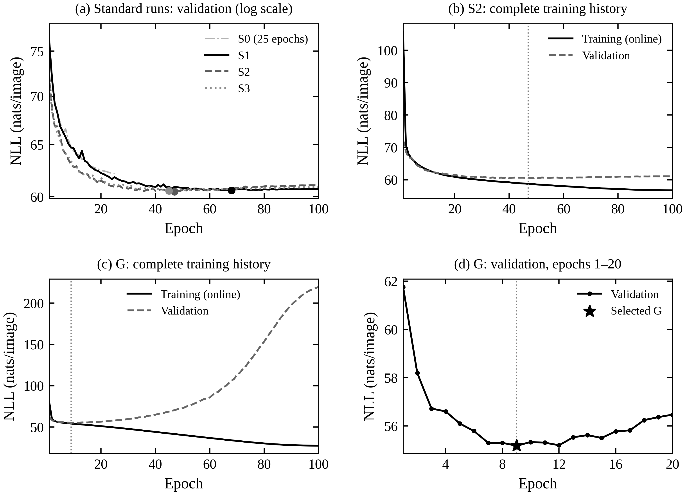
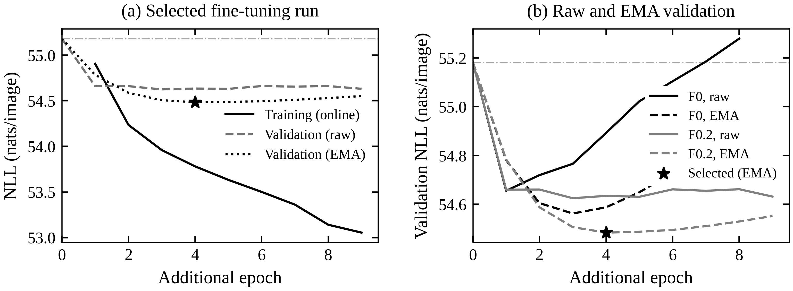

# Generative-AI-UCAS-Homework

Binary autoregressive modeling and PixelCNN experiments for UCAS generative AI coursework. This repository contains the probability proof, complete model implementation, seven recorded training experiments, all seven pretrained checkpoints, and commands to reproduce the data protocol, training, evaluation, and image generation.

[PDF report](docs/hw1-report.pdf) · [Editable Word report](docs/hw1-report.docx) · [Executed experimental notebook](notebooks/hw1-executed.ipynb) · [Reproduction tutorial](notebooks/reproduce-experiments.ipynb)



The image shows the complete, unfiltered batch from F0.2 at temperature 1 and seed 20260921. Black denotes pixel value 1. The checkpoint was selected by validation likelihood, not by the appearance of these images.

## Installation

Clone the repository and create a Python 3.9 environment:

```bash
git clone https://github.com/cscpyy-wen/Generative-AI-UCAS-Homework.git
cd Generative-AI-UCAS-Homework
python3.9 -m venv .venv
source .venv/bin/activate
python -m pip install --upgrade pip
```

For CPU evaluation, sampling, and small correctness checks:

```bash
python -m pip install -r requirements-cpu.txt
python -m pip install -e .
```

For the recorded Linux training environment with a compatible NVIDIA GPU and driver:

```bash
python -m pip install -r requirements-historical.txt
python -m pip install -e .
```

The recorded runs used Python **3.9.23**, PyTorch **1.12.1+cu102**, torchvision **0.13.1+cu102**, NumPy **1.23.5**, Matplotlib **3.9.4**, and an NVIDIA **TITAN RTX**. CPU and CUDA 10.2 wheel choices follow the [official PyTorch previous-version installation instructions](https://pytorch.org/get-started/previous-versions/). The dependency ranges in `pyproject.toml` support installation flexibility; they do not claim that the seven experiments have been repeated on every newer version. Full CPU training and alternative hardware have not been benchmarked.

Install `requirements-notebook.txt` when executing the notebooks in an existing Jupyter-compatible frontend. `requirements-report.txt` contains the optional packages used to inspect or edit the report; the prebuilt documents can be read without them.

## Start with the recorded results

Verify the released files and run a small, CPU-only synthetic check. These commands do not download MNIST or train the full models:

```bash
python scripts/verify_reference.py
python -m ucas_generative_ai smoke
```

For the full local project check (reference hashes, privacy/weight structure,
model and resume tests, and plot regeneration), install the optional report
inspection dependencies and run:

```bash
python -m pip install -r requirements-report.txt
bash scripts/check_project.sh
```

`ci/reproducibility.yml` is a GitHub Actions template for the same checks.
It is provided as a template; no hosted workflow is active in this release.
The local check excludes downloaded data and documented runtime-output
directories. A public-export audit should use `scripts/audit_privacy.py`
without `--exclude-generated` so that unexpected files are checked.

Rebuild the historical curves and all seven complete 64-image batches from the published arrays:

```bash
python scripts/plot_results.py --input results --output reproduced/reference-figures
```

Evaluate the selected pretrained checkpoint on the full official test split. MNIST is downloaded into `data/` on the first evaluation:

```bash
python -m ucas_generative_ai evaluate \
  --checkpoint checkpoints/f02.pt --experiment f02 --split test \
  --data-root data --device cpu --baselines \
  --output reproduced/f02-test.json
```

Generate a new complete batch from an empty canvas:

```bash
python -m ucas_generative_ai sample \
  --checkpoint checkpoints/f02.pt --experiment f02 \
  --output reproduced/f02-samples --n 64 --seed 20260921 --capture \
  --device auto
```

Autoregressive sampling performs 784 full network forwards. CPU sampling is substantially slower than reading the provided images. Sampling writes `samples.npy`, `samples.png`, optional `sampling_frames.npy`, and `sampling_metrics.json`. CPU and CUDA random generators need not produce the same pixel batch from the same integer seed.

## Seven recorded experiments

NLL uses natural logarithms and is summed over each 28×28 image. Lower is better. A dash means that the historical candidate was not separately evaluated on the test set.

| CLI ID | Report label | Model and training setup | Actual epochs | Selected checkpoint | Validation NLL | Test NLL | Recorded time (min) |
|---|---|---|---:|---|---:|---:|---:|
| `s0` | S0 | Standard; lr=0.001, batch=256 | 25 | 25, raw | 62.1652 | 62.1889 | 13.26 |
| `s1` | S1 | Standard; lr=0.001, batch=256 | 100 | 68, raw | 60.5759 | — | 73.81 |
| `s2` | S2 | Standard; lr=0.001, batch=128 | 100 | 47, raw | 60.4642 | 60.4827 | 102.36 |
| `s3` | S3 | Standard; lr=0.0005, batch=128 | 100 | 45, raw | 60.5535 | — | 65.46 |
| `g` | G | Two-stream dilated gated; lr=0.001, batch=128 | 100 | 9, raw | 55.1815 | 55.3111 | 178.25 |
| `f0` | F0 | G's epoch-9 weights; lr=0.0001, batch=128, dropout=0 | 8 additional | 3 additional, EMA | 54.5623 | 54.6944 | 15.24 |
| `f02` | F0.2 | Same G weights; lr=0.0001, batch=128, dropout=0.2 | 9 additional | 4 additional, EMA | 54.4841 | 54.6024 | 18.00 |

These are **442 training-data traversals**, counting S2 once even though it is reused in the structure comparison. The sum of the recorded per-run training/validation times is about **7.77 hours**; parallel execution and hardware contention make this a record of those runs, not a runtime estimate for another machine.



S0 uses 25-epoch cosine annealing with minimum lr=0.0001. S1–S3 are separately initialized 100-epoch runs with minimum lr=0.00001. S0 versus S1 therefore changes both duration and schedule. At the same number of data traversals, batch sizes 256 and 128 give 215 and 430 update attempts per epoch. The standard and gated models have **452,225** and **1,462,145** trainable parameters; the structure comparison changes gating, context paths, parameter count, and computation together.

G's complete curve shows overfitting after its best validation checkpoint. F0 and F0.2 start from the same G epoch-9 weights with **fresh Adam**, rather than continuing G's epoch-100 optimizer state. Both use EMA decay 0.999, ReduceLROnPlateau with factor 0.5, patience 2 and absolute threshold 0.02, minimum lr=0.00001, a maximum of 20 additional epochs, and early stopping after five epochs without an improvement greater than 0.02. Epoch 0 is an unchanged starting checkpoint, not a training epoch. The actual lowest raw/EMA validation score determines saved weights; the 0.02 threshold governs scheduling and stopping.



The selected F0.2 checkpoint reduces test NLL by **1.28% relative to G** and **12.20% relative to S0**. Likelihood, foreground proportion, and recognizability measure different properties. Some samples contain disconnected strokes or isolated pixels. Each configuration has one training seed, so the measurements do not establish the separate contribution of every component or a stable advantage across seeds.

## Reproduce the complete training protocol

This explicitly runs all seven experiments from fresh states in a new output directory:

```bash
python -m ucas_generative_ai train \
  --experiment all --output runs --data-root data --device auto
```

S0, S1, S2, S3 and G are separate training runs. F0/F0.2 use the best G checkpoint produced in that run, with separately numbered continuation epochs. A fresh run may select a different G epoch because floating-point kernels and hardware can change the learned trajectory. The historical epoch-9 checkpoint remains available as `checkpoints/g.pt`.

Reissuing the same command restores complete saved training states. To start another independent experiment, use another `--output` directory. `--no-resume` refuses existing training states; it does not delete them. Hyperparameters are defined in `configs/` and `src/ucas_generative_ai/config.py`, and configuration changes are checked before resuming.

Train one configuration, or repeat the continuation directly from the released historical G checkpoint:

```bash
python -m ucas_generative_ai train \
  --experiment s0 --output runs-s0 --data-root data --device auto

python -m ucas_generative_ai train \
  --experiment f02 --initial-checkpoint checkpoints/g.pt \
  --output runs-finetuning --data-root data --device auto
```

After a full training run, generate all seven batches into their experiment directories and replot the new records:

```bash
for experiment in s0 s1 s2 s3 g f0 f02; do
  python -m ucas_generative_ai sample \
    --checkpoint "runs/${experiment}/pixelcnn_best.pt" \
    --experiment "${experiment}" --output "runs/${experiment}" \
    --n 64 --seed 20260921 --capture --device auto
done
python scripts/plot_results.py --input runs --output reproduced/trained-figures
```

Training uses mixed precision with GradScaler on CUDA; fixed-weight validation, test evaluation, and sampling use FP32. CPU training disables CUDA mixed precision. Seeds fix initialization, the split and shuffled order, but bitwise agreement across devices, CUDA/cuDNN versions or different execution settings is not guaranteed. The original environment used `cudnn.benchmark=True`.

## Data and model protocol

- Official MNIST: 60,000 training-file images and 10,000 independent test-file images; the training file is split into **55,000 training / 5,000 validation** using seed **20260920**.
- Static binary pixels: `uint8 >= 128`, exactly equivalent to `pixel / 255 > 0.5`; no augmentation, resizing, dynamic binarization, or digit-label conditioning.
- Shuffling and unconditional sampling seed: **20260921**. Each trained epoch visits every training image once.
- First convolution uses mask A; hidden convolutions use mask B. Normalization operates only across channels at the same spatial position.
- Bernoulli logits are optimized with BCEWithLogitsLoss. `NLL/image = 784 × mean BCE/pixel`; `bits/pixel = mean BCE / ln(2)`.
- Configurations, raw/EMA weights and checkpoints are selected by validation NLL. Historical test scores are disclosed after the respective stages; they are not used in the implemented selection rules.
- The independent-pixel baseline fits smoothed probabilities from training pixels only. Its test NLL is **205.8452**, versus **543.4274** for fair Bernoulli pixels.

The results use this static threshold and custom validation split. They should not be compared directly with likelihood scores from dynamically binarized or otherwise different MNIST protocols.

## Repository layout

```text
src/ucas_generative_ai/     Models, data, training, checkpoints, sampling and CLI
configs/                   Seven experiment configurations
checkpoints/               Seven CPU tensor-only state_dict files
results/                   Recorded histories, metrics, arrays, split and hashes
notebooks/                 Executed source notebook and CLI reproduction tutorial
docs/                      Anonymous PDF/DOCX report, equations and figures
scripts/                   Reference verification and result plotting
ci/                        Optional GitHub Actions workflow template
```

The seven exported checkpoints total about **46.5 MB**. `results/manifest.json` identifies the released checkpoint and reference-file hashes. `results/summary.json` contains the seven-stage numerical summary. Published weights include model parameters and mask buffers, with no original optimizer/RNG training-state objects.

The executed notebook keeps the course section structure and original recorded outputs. Its portable path setting writes a new session into `runs/notebook-session/`; its original source covers S1/S2/S3, G and both continuation runs, with S0 shown as historical results. Use the CLI reproduction tutorial for an explicit fresh execution of all seven configurations.

## References

- van den Oord et al. [Pixel Recurrent Neural Networks](https://arxiv.org/abs/1601.06759), 2016.
- van den Oord et al. [Conditional Image Generation with PixelCNN Decoders](https://arxiv.org/abs/1606.05328), 2016.
- Salimans et al. [PixelCNN++](https://arxiv.org/abs/1701.05517), 2017. The continuation experiments borrow residual dropout and parameter averaging while retaining the coursework's binary Bernoulli likelihood.
- [PyTorch previous versions](https://pytorch.org/get-started/previous-versions/) for the historical installation commands.
